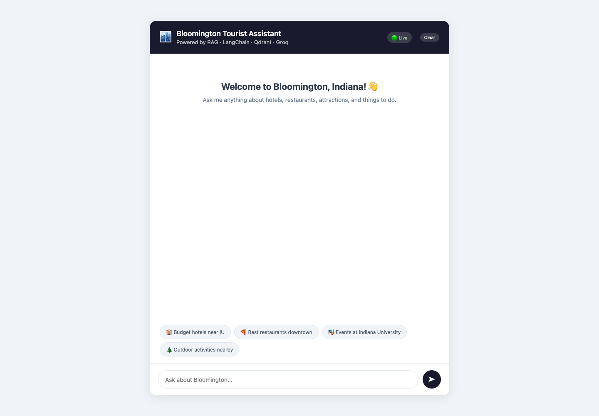
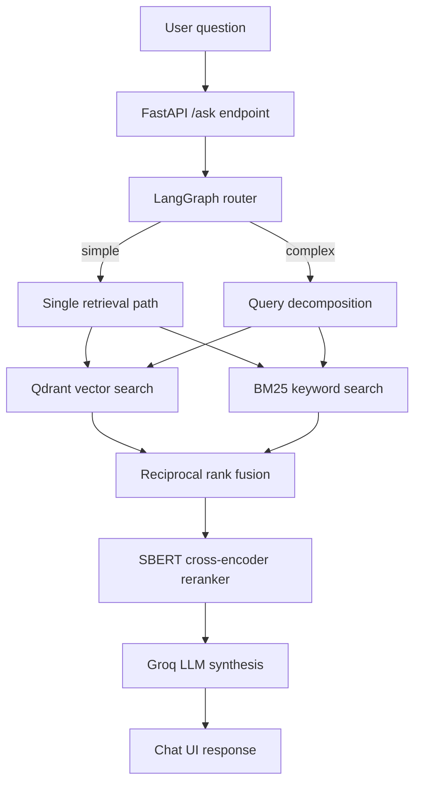

# Bloomington Tourist Assistant

A deployed RAG service for Bloomington, Indiana tourism questions. The system combines vector search, BM25, reciprocal rank fusion, cross-encoder reranking, LangGraph routing, and evaluation checks that run in GitHub Actions.

Live app: https://bloomington-rag-473936713859.us-central1.run.app/



## Architecture



## Proof points

| Area | Evidence |
| --- | --- |
| Retrieval quality | 86.67% top-1 retrieval accuracy, 13/15 eval questions |
| CI gate | GitHub Actions runs retrieval tests on every push and pull request |
| Faithfulness check | LLM-as-judge scored hotel queries at 0.89 |
| Deployment | GCP Cloud Run with a FastAPI backend and static chat UI |
| Known tradeoff | In-memory Qdrant rebuilds on cold start |

## Tech stack

- FastAPI, Uvicorn
- LangChain, LangGraph
- Qdrant in-memory vector store
- BM25, reciprocal rank fusion, SBERT reranking
- Groq `llama-3.1-8b-instant`
- GitHub Actions
- GCP Cloud Run

## Setup

```bash
git clone https://github.com/prathima-sola/bloomington-rag
cd bloomington-rag
python -m venv venv
source venv/bin/activate
pip install -r requirements.txt
cp .env.example .env
python src/prepare_data.py
uvicorn src.api:app --reload --port 8000
```

Open `http://localhost:8000`.

## Environment

```bash
GROQ_API_KEY=
```

The retrieval quality test does not need an API key. The live answer generation path needs `GROQ_API_KEY`.

## Test commands

```bash
cd tests
python test_retrieval.py
python faithfulness_eval.py
```

`test_retrieval.py` runs without LLM API calls. `faithfulness_eval.py` uses Groq.

## Deployment notes

- `Procfile` starts the FastAPI app for Cloud Run.
- The app loads processed documents, builds the in-memory Qdrant index, and serves the chat UI from `src/static`.
- Cold starts rebuild the vector index. A managed Qdrant instance would remove that rebuild time.

## Project structure

```text
bloomington-rag/
├── src/
│   ├── api.py
│   ├── rag_pipeline.py
│   ├── agentic_rag.py
│   ├── prepare_data.py
│   └── static/index.html
├── data/processed/
├── tests/
│   ├── test_retrieval.py
│   ├── faithfulness_eval.py
│   └── eval_dataset.py
├── .github/workflows/quality_gate.yml
└── Procfile
```

## Known limits

- The dataset is heavier on hotels than restaurants and attractions.
- Qdrant runs in memory for this version.
- The source data is static, so events, hours, and prices can age.
